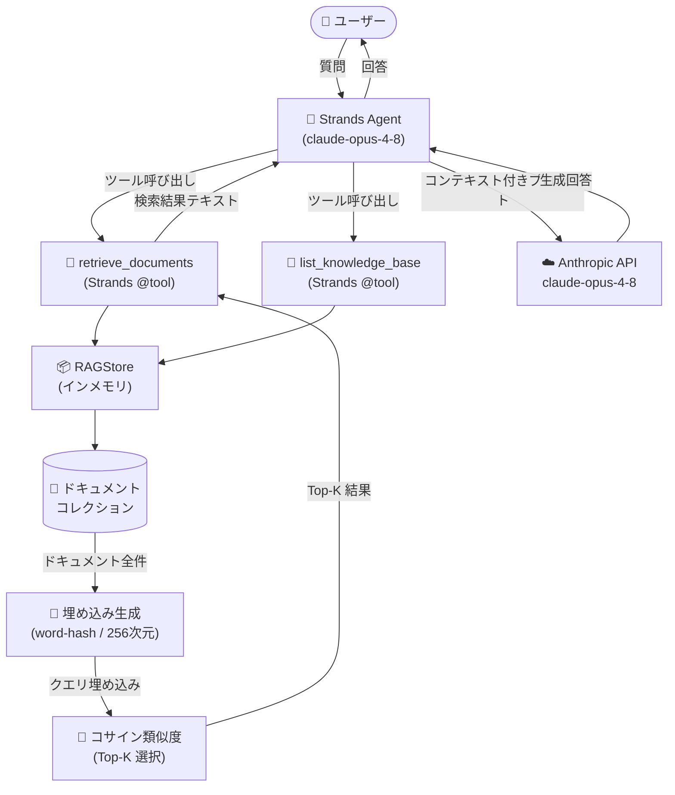
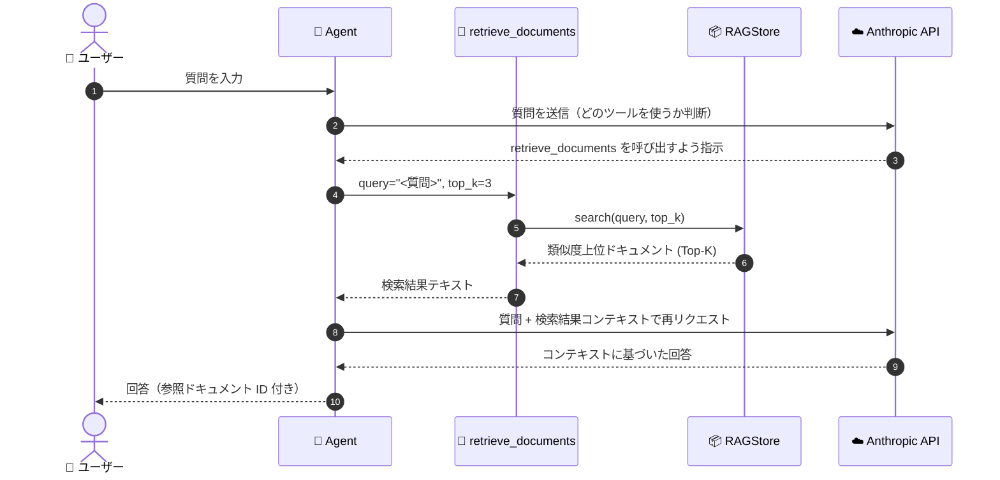

# Strands RAG + Agent サンプル

Strands Agents SDK と RAG（検索拡張生成）を組み合わせたエージェントのサンプルです。

## アーキテクチャ



## RAG フロー詳細



## ファイル構成

```
strands_rag_sample/
├── agent.py         # エージェント本体・デモ・対話モード
├── rag_store.py     # インメモリ RAG ストア（類似度検索）
├── rag_tools.py     # Strands @tool 定義（retrieve / list）
├── requirements.txt # 依存パッケージ
└── README.md        # 本ファイル
```

## セットアップと実行

```bash
pip install -r requirements.txt
export ANTHROPIC_API_KEY="your-api-key"

# デモモード
python agent.py

# 対話モード
python agent.py interactive
```

## ドキュメントの追加

`agent.py` の `SAMPLE_DOCUMENTS` リストにエントリを追加するだけです。

```python
{
    "id": "my-doc",
    "text": "追加したいテキスト内容...",
    "metadata": {"category": "my-category"},
}
```

本番環境では `RAGStore._embed()` を Voyage AI や OpenAI Embeddings に差し替え、
ストレージを Pinecone / pgvector 等に切り替えることを推奨します。
